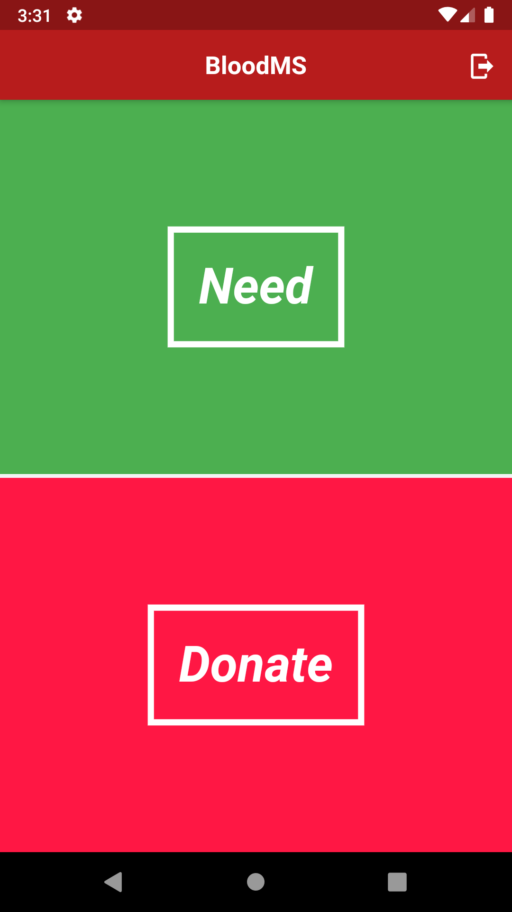
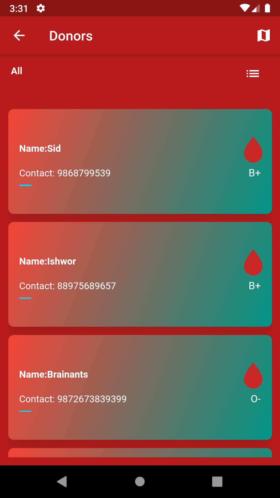
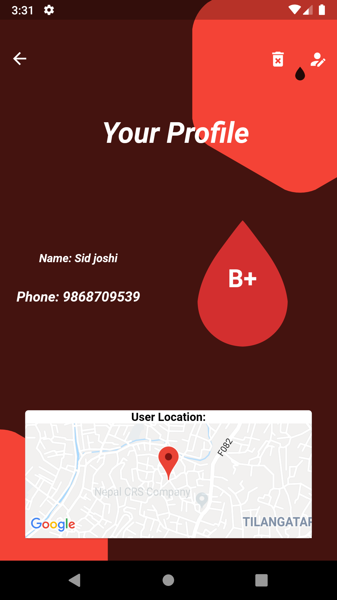

# :heart: BloodMS :heart:

 :fire: :fire: :fire: A blood management project. :fire: :fire: :fire:

## :key: Key features

 :heavy_check_mark: Logins for users/members, 
 :heavy_check_mark: New donor can be added, 
 :heavy_check_mark: Donor can be contacted easily with the contact info, 
 :heavy_check_mark: List of the donors can be easily available from map view, 
 :heavy_check_mark: You can add yourself as donor, 
 :heavy_check_mark: Realtime data update, 
 :heavy_check_mark: Security for authenticated user. 

## :thought_balloon: Objectives
 :heavy_check_mark: To develop a computerized centralized blood management system.  
 :heavy_check_mark: To develop automated system for tracking of blood products from initial ordering of
blood through the transfusion of blood in patient, to updating data and records.  
 :heavy_check_mark: To create easy, hassle free and transparent interface between donor, receiver. 
 :heavy_check_mark: To record and document the data in proper, long lasting and secure manner. 
 :heavy_check_mark: To manage donated blood properly and effectively especially rare blood type. 
 :heavy_check_mark: To save life as much as possible.

## :runner: Working Example :runner:

### Part 1 

### Part 2

### Part 3

##  :iphone: Screenshots :iphone:

            

## :paperclip: Used plugins :paperclip:

   :heavy_check_mark: **polygon_clipper** 
   :heavy_check_mark: **cloud_firestore** 
   :heavy_check_mark: **firebase_auth** 
   :heavy_check_mark: **firebase_storage** 
   :heavy_check_mark: **cupertino_icons** 
   :heavy_check_mark: **material_design_icons_flutter** 
   :heavy_check_mark: **google_maps_flutter** 
   :heavy_check_mark: **location** 

### :heart: Loved or  Liked :+1: the work don't forget to :star: the repo :fire: :fire: :fire:
